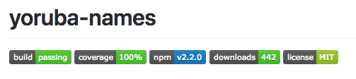

Yoruba-Names is an opensource micro javascript library . And before you ask: It's GNU 3.0 licensed!

---

# Easy to setup


npm install --save yoruba-names


# Easy to use


var yorubaNames = require('yoruba-names');

// Get a random Yoruba name
console.log(yorubaNames.random());

// Get a random number of Yoruba names
console.log(yorubaNames.random(2));

// Get a random Yoruba fullname
console.log(yorubaNames.random() + " " + yorubaNames.random());


# Wow even in our browsers


<html>

<head>
    
</head>

<body>
    <button onclick="document.write(yorubaNames.random())">Get a random name</button>
    <button onclick="document.write(yorubaNames.random(4))">Get a random number of names</button>
</body>

</html>


---

# Contribute

Found a bug? Have a good idea for improving Yoruba-Names? Head over to [the github page](https://github.com/mczlatan/yoruba-names) and create a new ticket or fork. 
You can also directly add issues and feature requests to the issue tracker.
If you just want to chat with me, my twitter is [here](/)